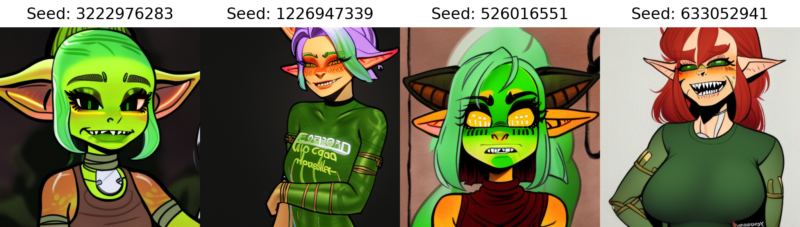

# sd-embeddings

## [incasegoblin](waifu_1_3/incasegoblin-100000.pt)

3 vector embedding trained on pictures from incases butsmithy comic of goblins, using Waifu Diffusion 1.3 weights.
```
female_goblin,pointy_ears,green_skin,[:incasegoblin:0.2], (shirt:1.2)
Steps: 68, Sampler: Euler a, CFG scale: 7, Seed: 633052941, Size: 512x512, Model hash: e1de58a9

```
